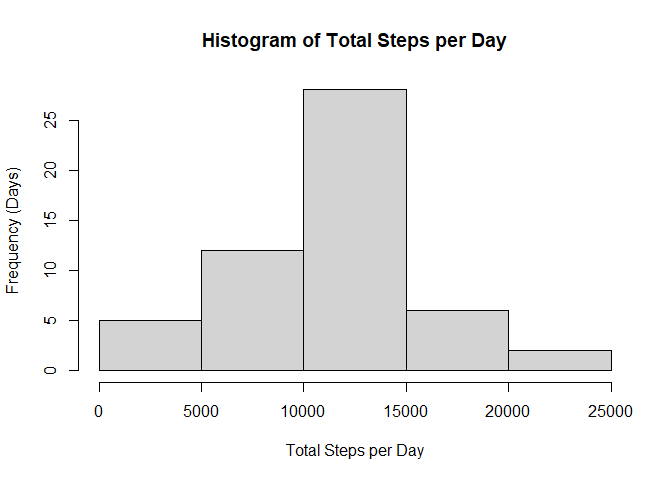
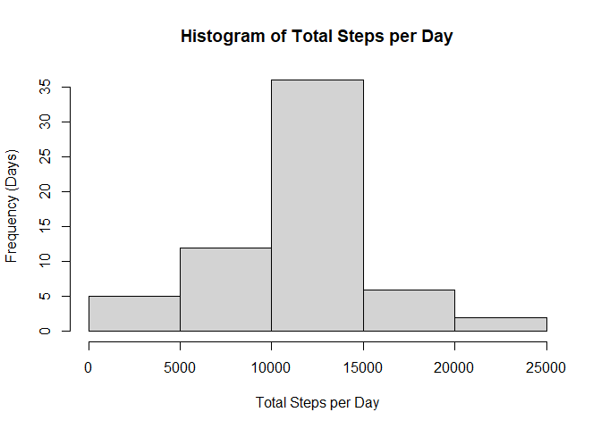
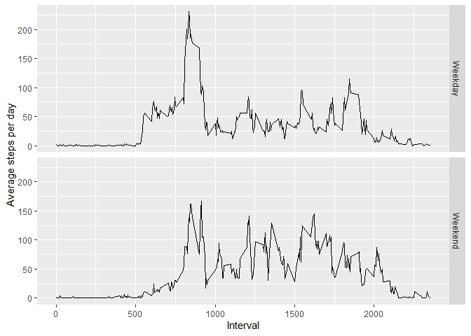

## Loading and preprocessing the data

First I'll load the needed libraries

```r
library(knitr)
library(dplyr)
```

```
## 
## Attaching package: 'dplyr'
```

```
## The following objects are masked from 'package:stats':
## 
##     filter, lag
```

```
## The following objects are masked from 'package:base':
## 
##     intersect, setdiff, setequal, union
```

```r
library(lubridate)
```

```
## 
## Attaching package: 'lubridate'
```

```
## The following objects are masked from 'package:base':
## 
##     date, intersect, setdiff, union
```

```r
library(ggplot2)
```


Now I'll unzip the data and load it into a table

```r
unzip("activity.zip")
activity <- read.csv("activity.csv")
```


## What is mean total number of steps taken per day?

I'll create a histogram that shows the distribution of total steps per day. I need to remove the NAs to do this.

```r
activity_filtered <- activity %>% filter(!is.na(steps)) %>% group_by(date) %>% summarize(total_steps=sum(steps))

hist(activity_filtered$total_steps,xlab="Total Steps per Day",ylab="Frequency (Days)",main="Histogram of Total Steps per Day")
```

<!-- -->

```r
mean_steps <- mean((activity %>% filter(!is.na(steps)) %>% group_by(date) %>% summarize(total_steps=sum(steps)))$total_steps)
median_steps <- median((activity %>% filter(!is.na(steps)) %>% group_by(date) %>% summarize(total_steps=sum(steps)))$total_steps)
```

The mean total number of steps taken per day is 1.0766189\times 10^{4}.

The median total number of steps taken per day is 10765.

## What is the average daily activity pattern?

To calculate the average steps per interval, I need to remove the NAs, group by the interval, and then calculate the mean for each interval.

Below is a line plot that shows the average steps per interval over the day


```r
average_activity <- activity %>% filter(!is.na(steps)) %>% group_by(interval) %>% summarize(average_steps=mean(steps))
with(average_activity,plot(interval,average_steps,type="l",xlab="Interval",ylab="Average steps per day"))
```

<!-- -->

The 5 minute interval with the highest average steps is interval 835 with an average steps of 206.1698113

Here is the code that calculates these values

```r
average_activity[which.max(average_activity$average_steps),]$interval
```

```
## [1] 835
```

```r
average_activity[which.max(average_activity$average_steps),]$average_steps
```

```
## [1] 206.1698
```

## Imputing missing values

Now I will impute the missing values. My method is to replace NAs with the average steps per interval. This has already been calculated above in the average_activity data frame.

The first step is to do a left join with activity and average_activity. Then I will mutate the result to replace the NAs with the average steps

```r
activity_imputed <- left_join(activity,average_activity,by="interval")
activity_imputed <- activity_imputed %>% mutate(steps=if_else(is.na(steps),average_steps,steps))
```
Here is a histogram of the resulting data that shows the distribution of total steps per day. Note that I do not need to remove NAs this time.

```r
hist((activity_imputed %>% group_by(date) %>% summarize(total_steps=sum(steps)))$total_steps,xlab="Total Steps per Day",ylab="Frequency (Days)",main="Histogram of Total Steps per Day")
```

<!-- -->

```r
mean_imputed_steps <- mean((activity_imputed  %>% group_by(date) %>% summarize(total_steps=sum(steps)))$total_steps)

median_imputed_steps <- median((activity_imputed  %>% group_by(date) %>% summarize(total_steps=sum(steps)))$total_steps)
```
The mean total number of steps taken per day is 1.0766189\times 10^{4} for the imputed data.

The median total number of steps taken per day is 1.0766189\times 10^{4} for the imputed data.


## Are there differences in activity patterns between weekdays and weekends?

To answer this question I must first classify each day as a weekday or weekend.

```r
activity_imputed <- activity_imputed %>% mutate(weekday=if_else(weekdays(ymd(date)) %in% c("Saturday","Sunday"),"Weekend","Weekday"))
```

Now I can calculate the average steps per interval just like above. I then graph it using ggplot with two facets. The top panel shows the weekday graph and the bottom one shows the weekend graph.


```r
average_activity_imputed <- activity_imputed %>% group_by(interval,weekday) %>% summarize(average_steps=mean(steps))
```

```
## `summarise()` has grouped output by 'interval'. You can override using the
## `.groups` argument.
```

```r
g <- ggplot(average_activity_imputed) + aes(x=interval,y=average_steps,group=weekday) + geom_line() + facet_grid(weekday ~ .) + xlab("Interval") + ylab("Average steps per day")
print(g)
```

<!-- -->
